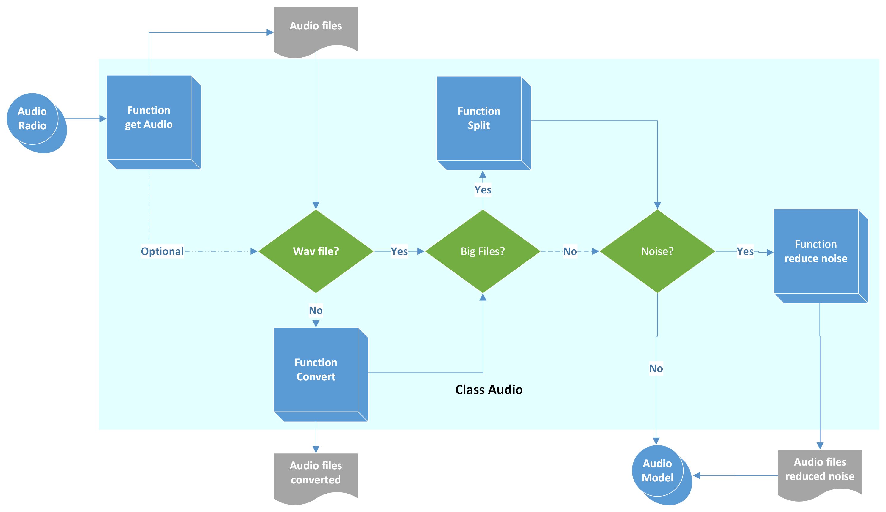

# InSTT
InsTT is Iberian noisy Speech To Text software.


***

## Name
InsTT is Iberian noisy Speech To Text software.

## Description
During military operations, mission success can hinge on intelligence extracted from voice conversations. These communications must be transcribed to text for analysis; however, audio-recordings are rarely of studio-quality. This challenge is to create a Speech-to-Text (STT) system capable of accurately transcribing noisy communications. The system should be designed to overcome various types of noise pollution such as background noise, radio feedback and/or multiple speakers.
InSTT is a software application intended to help transcription from speech audio to text. To do this task, InSTT is augmented with some features like noise reduction, environmental noise digital discrimination and conversations selection by using machine learning (ML) models and eventually natural language processors (NLP) models.

## Installation

For installing in local mode, download this Git:

After, use: pip install -r requirements.txt

We recommend to install Pytorch manually in order to mitigate potential compatibility issues across different operating systems and Python versions. Use the detailed process in:

https://pytorch.org/get-started/locally/

## Usage

Operating systems:

- Windows 10 (tested)
- Linux (Ubuntu 22.04)

Go to main folder (root) and type the next command for creating a running virtual environment:

> env.bat

For running App type the next command (in Windows command line):

> python app.py

When running application in local mode, Flask opens a socket in port 5000. We can navigate writting in our web browser: http://localhost:5000/

# Software achitecture

## Web User interface

For Web UI deployment we have used Flask. Flask is a Python web framework and networking library. Yo can use, alternately Tornado which is another framework, using non-blocking network I/O. It can scale to tens of thousands of open connections, making it ideal for long polling, WebSockets, and other applications that require a long-lived connection to each user. When running application in local mode, Flask activates a socket in port 5000. We can navigate writting in our web browser: http://localhost:5000/

## Audio treatment

The audio processing procedure encompasses recording, format conversion when necessary, segmenting audio in nearly all cases, and implementing noise reduction. The primary tool utilized for noise reduction is an open-source module known as 'noisereduce'. Additional info can be read in Documentation folder.



## Audio transcription and translation

For transcription and translation functionalities, we chose to explore two open-source modules: Whisper AI and SpeechBrain modules. While some related studies suggest that both could potentially serve for diarization tasks as well, our current focus involves fine-tuning models to render this task achievable, straightforward, and efficient. Additional info can be read in Documentation folder.


## References

- OpenAI whisper: https://github.com/openai/whisper/tree/main
- Noise reducing Noisereduce: https://pypi.org/project/noisereduce/
- Flask framework: https://flask.palletsprojects.com/en/3.0.x/
- Tornado framework: https://www.tornadoweb.org/en/stable/

## Roadmap
This Git contains a Web framework for deploying a noise reducer with speech to text transcription. Next steps:
- Enabling whisper and vosk model transcription from audio.
- Visualizing live transcription in textbox.

## Contributing
State if you are open to contributions and what your requirements are for accepting them.

You can also document commands to lint the code or run tests. These steps help to ensure high code quality and reduce the likelihood that the changes inadvertently break something. Having instructions for running tests is especially helpful if it requires external setup, such as starting a Selenium server for testing in a browser.

## Authors and acknowledgment
- Francisco Jose Ochando Terreros. Ms Computer engineer 
- Antonio Miguel Mejias Vello. Ms Armament engineer (Telecommunications engineer)

We appreciate the contribution of Spanish Army for this development.

## License
Open source project

## Project status
Fine tuning models for better transcription.

## Adding files

- [ ] [Create](https://docs.gitlab.com/ee/user/project/repository/web_editor.html#create-a-file) or [upload](https://docs.gitlab.com/ee/user/project/repository/web_editor.html#upload-a-file) files
- [ ] [Add files using the command line](https://docs.gitlab.com/ee/gitlab-basics/add-file.html#add-a-file-using-the-command-line) or push an existing Git repository with the following command:

```
cd existing_repo
git remote add origin [https://github.com/minitecnia/Noisy_Speech_Transcription/tree/main]
git branch -M main
git push -uf origin main
```
## Test and Deploy

Use the built-in continuous integration in GitLab.

- [ ] [Get started with GitLab CI/CD](https://docs.gitlab.com/ee/ci/quick_start/index.html)
- [ ] [Analyze your code for known vulnerabilities with Static Application Security Testing (SAST)](https://docs.gitlab.com/ee/user/application_security/sast/)
- [ ] [Deploy to Kubernetes, Amazon EC2, or Amazon ECS using Auto Deploy](https://docs.gitlab.com/ee/topics/autodevops/requirements.html)
- [ ] [Use pull-based deployments for improved Kubernetes management](https://docs.gitlab.com/ee/user/clusters/agent/)
- [ ] [Set up protected environments](https://docs.gitlab.com/ee/ci/environments/protected_environments.html)

## Technologies
For sucessfully develop this project we have use the next known technologies:
- Python and C++ languages
- Jupyter notebook and Visual Studio Code frameworks for coding
- Noisereduce module for digital noise reduction
- Pyaudio and scipy for audio treatment
- Whisper module: AI module for speech to text transcription
- Vosk module (Alphacephei)
- Openai API for interacting with natural languaje processors
- Openai ChatGPT for Chat prompting
- GPT4All platforma for local chat prompting

## Test files
https://commons.wikimedia.org/wiki/Category:Audio_files_of_speeches_about_World_War_II

## Useful links
- https://github.com/timsainb/noisereduce/tree/master
- https://github.com/jitsi/jiwer
- https://github.com/SYSTRAN/faster-whisper


